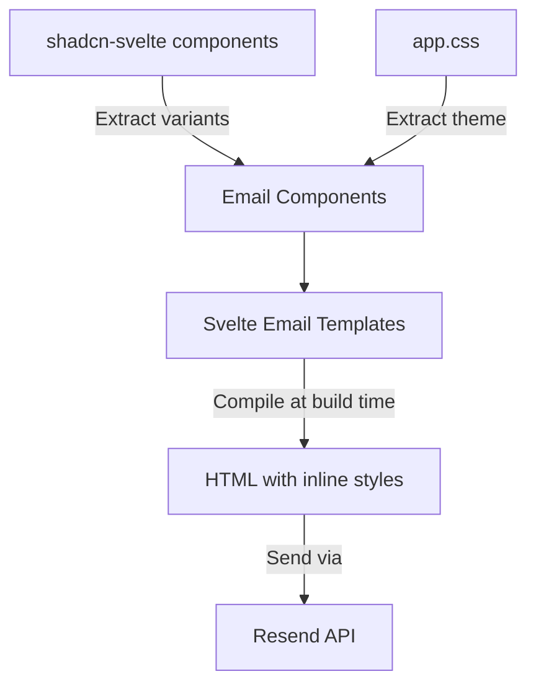

# Email Template System Architecture

## Overview

This document outlines the architecture for creating email templates that automatically inherit styles from our shadcn-svelte components while remaining email-client compatible. The system uses Svelte for templating, extracts design tokens from our existing components, and compiles everything to email-safe HTML.

## Core Principles

1. **Single Source of Truth**: All design tokens come from shadcn-svelte components
2. **No Manual Style Updates**: When shadcn styles change, emails automatically update
3. **Email Client Compatibility**: Output is table-based HTML with inline styles
4. **Type Safety**: Full TypeScript support for email props and templates
5. **No React Dependencies**: Pure Svelte solution

## Technology Stack

### Dependencies

- **svelte-email**: Provides email-safe component primitives (Html, Body, Container, etc.)
- **svelte-email-tailwind**: Converts Tailwind classes to inline styles at build time
- **juice**: CSS inlining library for email compatibility
- **resend**: Email delivery service
- **oslo**: Cryptographically secure token generation

### How It Works



## Implementation Strategy

### 1. Extracting Styles from shadcn-svelte

We'll reuse the Tailwind variant functions from existing shadcn components:

```typescript
// Original shadcn button
export const buttonVariants = tv({
	base: 'inline-flex items-center justify-center...',
	variants: {
		variant: {
			default: 'bg-primary text-primary-foreground...',
			secondary: 'bg-secondary text-secondary-foreground...'
		}
	}
});
```

### 2. Creating Email-Safe Wrappers

Email components will import these variants but render email-compatible HTML:

```svelte
<!-- src/lib/emails/components/EmailButton.svelte -->
<script lang="ts">
	import { buttonVariants } from '$lib/components/ui/button/button.svelte';
	import { Button } from 'svelte-email';

	export let href: string;
	export let variant: 'default' | 'secondary' = 'default';

	// Get Tailwind classes from shadcn component
	$: classes = buttonVariants({ variant });
</script>

<Button {href} class={classes}>
	<slot />
</Button>
```

### 3. Theme Extraction

Extract CSS variables from `app.css` at build time:

```typescript
// src/lib/emails/theme-extractor.ts
export function extractTheme() {
	// Parse app.css
	// Convert CSS variables to values
	// Convert oklch to hex for email compatibility
	return {
		primary: '#0A0A0B',
		background: '#FFFFFF',
		foreground: '#0A0A0B'
		// ... all design tokens
	};
}
```

### 4. Email Template Structure

```svelte
<!-- src/lib/emails/templates/VerificationEmail.svelte -->
<script lang="ts">
	import { Html, Head, Body, Container } from 'svelte-email';
	import EmailButton from '../components/EmailButton.svelte';
	import EmailCard from '../components/EmailCard.svelte';

	export let code: string;
	export let expiryMinutes: number = 20;
</script>

<Html>
	<Head />
	<Body>
		<Container>
			<EmailCard>
				<h1>Verify Your Email</h1>
				<div class="text-3xl font-bold">{code}</div>
				<p>This code expires in {expiryMinutes} minutes</p>
				<EmailButton href="https://app.com/verify" variant="default">Verify Email</EmailButton>
			</EmailCard>
		</Container>
	</Body>
</Html>
```

### 5. Compilation Pipeline

The `svelte-email-tailwind` Vite plugin will:

1. Process Svelte email templates
2. Extract all Tailwind classes
3. Convert them to inline styles
4. Output email-ready HTML

## Component Compatibility Matrix

| Component     | Email Compatible | Modifications Needed                   |
| ------------- | ---------------- | -------------------------------------- |
| **Card**      | ✅ Yes           | Remove refs, use table structure       |
| **Badge**     | ✅ Yes           | Static variant only                    |
| **Button**    | ⚠️ Partial       | Remove JS handlers, loading state      |
| **Separator** | ✅ Yes           | Convert to `<hr>`                      |
| **Alert**     | ⚠️ Partial       | Remove icon components                 |
| **Input**     | ❌ No            | Forms don't work in many email clients |
| **Dialog**    | ❌ No            | Requires JavaScript                    |
| **Select**    | ❌ No            | Interactive elements not supported     |

## Email-Safe Components to Create

### Priority 1 (Essential)

- `EmailButton` - CTA buttons with shadcn styles
- `EmailCard` - Content containers
- `EmailBadge` - Status indicators
- `EmailSeparator` - Visual dividers

### Priority 2 (Enhancement)

- `EmailAlert` - Notification boxes
- `EmailTable` - Data display
- `EmailHeading` - Typography components

## File Structure

```
src/lib/emails/
├── components/           # Email-safe component wrappers
│   ├── EmailButton.svelte
│   ├── EmailCard.svelte
│   └── EmailBadge.svelte
├── templates/           # Full email templates
│   ├── VerificationEmail.svelte
│   ├── WelcomeEmail.svelte
│   └── PasswordResetEmail.svelte
├── compiler.ts          # Email compilation logic
├── theme-extractor.ts   # CSS variable extraction
└── types.ts            # TypeScript definitions
```

## Usage Example

```typescript
// src/lib/convex/auth/ResendOTP.ts
import { render } from 'svelte-email';
import VerificationEmail from '$lib/emails/templates/VerificationEmail.svelte';

export async function sendVerificationEmail(email: string, code: string) {
	// Render Svelte template to HTML
	const html = render({
		template: VerificationEmail,
		props: {
			code,
			expiryMinutes: 20
		}
	});

	// Send via Resend
	await resend.emails.send({
		from: 'noreply@app.com',
		to: email,
		subject: 'Verify your email',
		html
	});
}
```

## Benefits

1. **Automatic Style Synchronization**
   - Changes to shadcn components automatically reflect in emails
   - No need to manually update email styles

2. **Maintainability**
   - Single source of truth for design system
   - Email components reuse existing variant logic

3. **Developer Experience**
   - Write emails using familiar Svelte syntax
   - Full TypeScript support
   - Hot reload during development

4. **Email Client Compatibility**
   - Outputs table-based layouts
   - All styles are inlined
   - Fallback colors for older clients

5. **Performance**
   - Templates compiled at build time
   - No runtime overhead
   - Cached compilation results

## Migration Path

### Phase 1: Core Setup

1. Install `svelte-email` and `svelte-email-tailwind`
2. Create email-safe component wrappers
3. Set up theme extraction

### Phase 2: Essential Templates

1. Verification email
2. Password reset email
3. Welcome email

### Phase 3: Enhancement

1. Add more email components as needed
2. Create notification templates
3. Build transactional emails

## Testing Strategy

### Local Development

- Use svelte-email preview server
- Test with different email clients via Litmus/Email on Acid
- Verify inline styles are applied correctly

### Automated Testing

- Snapshot testing for compiled HTML
- Visual regression testing
- Accessibility checks

## Considerations

### Limitations

- Not all shadcn components can be used in emails
- JavaScript interactions are not possible
- Some CSS properties aren't supported in email clients

### Best Practices

- Keep email templates simple
- Always provide plain text fallbacks
- Test across multiple email clients
- Use table layouts for compatibility
- Limit width to 600px for mobile

## Future Enhancements

1. **Build-time Optimization**
   - Cache compiled templates
   - Pre-compile common emails
   - Optimize inline CSS

2. **Advanced Features**
   - Dark mode support (where supported by email clients)
   - Responsive layouts using media queries
   - AMP email support

3. **Developer Tools**
   - Email preview in different clients
   - Automated email testing
   - Performance monitoring

## Conclusion

This architecture provides a robust, maintainable system for creating emails that automatically stay in sync with our application's design system. By reusing shadcn-svelte's variant logic and Tailwind classes, we ensure consistency without duplication while maintaining full email client compatibility.
