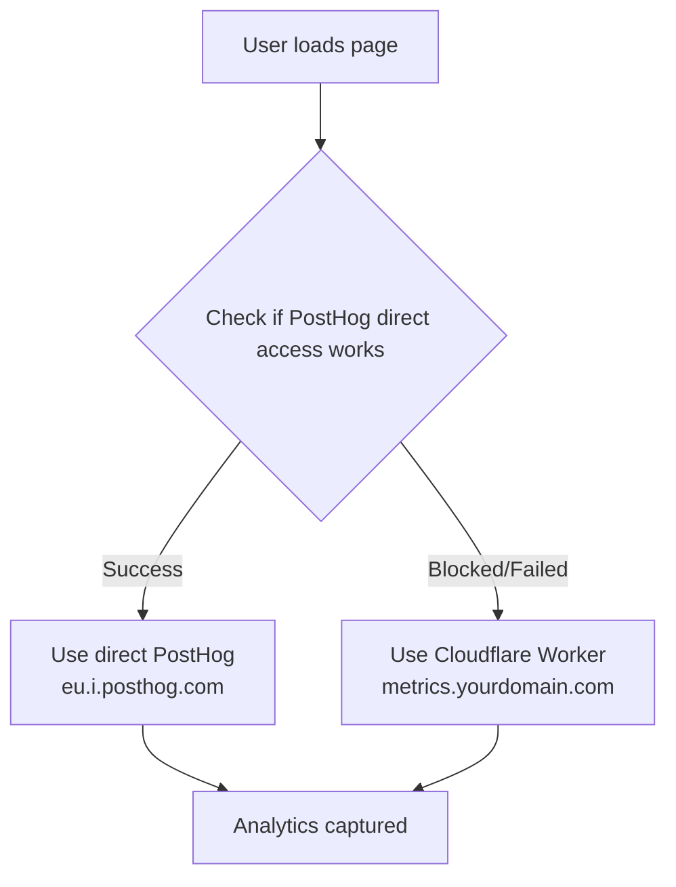

# PostHog Cloudflare Proxy Setup Guide

This guide explains how to set up a cost-effective PostHog reverse proxy using Cloudflare Workers that only activates when ad blockers prevent direct PostHog access.

## Table of Contents

- [Overview](#overview)
- [Why Use a Proxy?](#why-use-a-proxy)
- [Cost-Effective Strategy](#cost-effective-strategy)
- [Setup Instructions](#setup-instructions)
  - [Part 1: Cloudflare Worker Setup](#part-1-cloudflare-worker-setup)
  - [Part 2: Environment Configuration](#part-2-environment-configuration)
  - [Part 3: Testing](#part-3-testing)
- [How It Works](#how-it-works)
- [Monitoring Cloudflare Usage](#monitoring-cloudflare-usage)
- [Troubleshooting](#troubleshooting)

## Overview

This implementation uses a **smart fallback strategy** that minimizes Cloudflare Worker costs while ensuring 100% analytics coverage:

1. **First attempt**: Direct connection to PostHog (free, no proxy)
2. **Fallback**: If blocked, automatically switch to Cloudflare Worker proxy

This approach typically reduces Cloudflare costs by **99%** compared to always-on proxying.

## Why Use a Proxy?

Ad blockers and privacy tools often block analytics services like PostHog by domain name. A reverse proxy hosted on your own domain bypasses these blocks while maintaining user privacy and data accuracy.

**Benefits:**

- ✅ Capture analytics from users with ad blockers
- ✅ Minimize data loss and improve insights
- ✅ Preserve accurate geolocation data
- ✅ Reduce Cloudflare costs (only proxy when needed)

## Cost-Effective Strategy

**Traditional Approach (Expensive):**

- All users → Cloudflare Worker → PostHog
- Cost: ~100,000+ requests/month on free tier limit

**Our Approach (Cost-Optimized):**

- Most users → Direct to PostHog (free)
- Ad blocker users → Cloudflare Worker → PostHog
- Cost: ~5,000-10,000 requests/month (well within free tier)

**Why This Works:**

The client-side code attempts a HEAD request to `eu.i.posthog.com` before initializing PostHog. If successful, it uses direct connection. If blocked (typically 5-10% of users with ad blockers), it automatically switches to your Cloudflare Worker.

## Setup Instructions

### Part 1: Cloudflare Worker Setup

#### Step 1: Create the Worker

1. Log into your [Cloudflare Dashboard](https://dash.cloudflare.com)
2. Navigate to: **Workers & Pages** → **Create** → **Create Worker**
3. Choose a **non-obvious name** for the worker:
   - ✅ Good: `data-sync`, `metrics-api`, `app-telemetry`, or random string
   - ❌ Bad: `posthog`, `analytics`, `tracking`, `stats` (likely to be blocked)
4. Click **Deploy** to create the worker

#### Step 2: Add the Proxy Code

1. Click **Edit code** (or **Quick edit** if already on the worker page)
2. **Delete all existing code** in the editor
3. Copy the entire contents of [`docs/posthog-proxy-worker.js`](./posthog-proxy-worker.js)
4. Paste into the Cloudflare Worker editor
5. Click **Deploy** to save

**Note:** The worker code is already configured for the EU region (`eu.i.posthog.com`). If you're using the US region, edit lines 19-20:

```javascript
const API_HOST = 'us.i.posthog.com'; // Change to US region
const ASSET_HOST = 'us-assets.i.posthog.com'; // Change to US region
```

#### Step 3: Add a Custom Domain

**Important:** This step is required for production use. The default `*.workers.dev` domain is often blocked by ad blockers.

1. In the worker page, click **Settings** → **Triggers**
2. In the **Routes** section, click **Add Custom Domain**
3. Enter a subdomain of your domain:
   - ✅ Good: `metrics.yourdomain.com`, `data-sync.yourdomain.com`, `app-api.yourdomain.com`
   - ❌ Bad: `tracking.yourdomain.com`, `analytics.yourdomain.com` (likely to be blocked)
4. Click **Add Custom Domain**
5. Wait for DNS propagation (usually instant, but can take up to 5 minutes)

**Your worker URL is now:** `https://metrics.yourdomain.com` (use your chosen subdomain)

### Part 2: Environment Configuration

#### Step 1: Update Local Environment

1. Open `.env.local` in your project root
2. Add the following variable with your custom domain:

```env
# PostHog Cloudflare Proxy (fallback when direct access is blocked)
PUBLIC_POSTHOG_PROXY_HOST=https://metrics.yourdomain.com
```

Replace `metrics.yourdomain.com` with your actual custom domain from Part 1, Step 3.

#### Step 2: Update Production Environment (Vercel)

1. Go to your [Vercel Dashboard](https://vercel.com/dashboard)
2. Select your project
3. Navigate to: **Settings** → **Environment Variables**
4. Add a new environment variable:
   - **Name:** `PUBLIC_POSTHOG_PROXY_HOST`
   - **Value:** `https://metrics.yourdomain.com` (your custom domain)
   - **Environment:** Check all: Production, Preview, Development
5. Click **Save**

**Important:** You'll need to redeploy your application for the environment variable to take effect.

### Part 3: Testing

#### Test 1: Normal Users (Direct PostHog)

1. Open your application in a browser **without ad blockers**
2. Open browser DevTools → Network tab
3. Filter by `posthog` or your domain
4. You should see requests going directly to `eu.i.posthog.com`
5. ✅ **Success:** No Cloudflare Worker requests (cost-free)

#### Test 2: Ad Blocker Users (Cloudflare Fallback)

1. Install an ad blocker (uBlock Origin, AdBlock Plus, etc.)
2. Enable ad blocking
3. Clear browser cache and reload your application
4. Open browser DevTools → Network tab
5. You should see requests going to `metrics.yourdomain.com` (your custom domain)
6. ✅ **Success:** Cloudflare Worker is proxying requests

#### Test 3: Verify Events in PostHog

1. Open your [PostHog Dashboard](https://eu.posthog.com)
2. Go to: **Activity** → **Events**
3. Perform some actions on your site (page views, clicks, etc.)
4. Verify events are appearing in real-time
5. ✅ **Success:** Events from both direct and proxied users appear

#### Test 4: Verify Geolocation Accuracy

1. In PostHog dashboard, click on an event
2. Check the `$geoip_city_name`, `$geoip_country_code` properties
3. Verify they match your actual location (not Cloudflare's data center)
4. ✅ **Success:** X-Forwarded-For header is working correctly

## How It Works

### Client-Side Initialization Flow



### Implementation Details

**1. Direct Access Check (`src/routes/+layout.ts`)**

```typescript
try {
	// Attempt to reach PostHog directly
	await fetch(PUBLIC_POSTHOG_HOST, { method: 'HEAD', mode: 'no-cors' });
	apiHost = PUBLIC_POSTHOG_HOST; // Direct access works
} catch (error) {
	apiHost = PUBLIC_POSTHOG_PROXY_HOST; // Fallback to proxy
}
```

**2. PostHog Initialization**

```typescript
posthog.init(PUBLIC_POSTHOG_API_KEY, {
	api_host: apiHost, // Either direct or proxy
	ui_host: 'https://eu.posthog.com' // Always use actual PostHog UI
});
```

**3. Cloudflare Worker Proxy**

- Receives requests on your custom domain
- Forwards to `eu.i.posthog.com` with preserved IP headers
- Caches static assets for performance
- Returns response to client

## Monitoring Cloudflare Usage

### Check Worker Invocations

1. Go to [Cloudflare Dashboard](https://dash.cloudflare.com)
2. Navigate to: **Workers & Pages** → Your Worker
3. Click **Metrics** tab
4. View **Requests** graph to see usage over time

**Expected Usage:**

- **Without this setup:** 100,000+ requests/month (all users)
- **With this setup:** 5,000-10,000 requests/month (~5-10% of users)

### Cloudflare Free Tier Limits

- **100,000 requests/day** (3 million/month)
- Our optimized approach uses ~5-10k/month
- Well within free tier limits ✅

### Alert Setup (Optional)

Set up Cloudflare Worker usage alerts:

1. Go to: **Notifications** in Cloudflare Dashboard
2. Click **Create Notification**
3. Select **Worker Exceeded Requests Threshold**
4. Set threshold: 90,000 requests/day (90% of free tier)
5. Add your email

## Troubleshooting

### Issue: All users using proxy (high Cloudflare costs)

**Symptom:** Cloudflare shows 100,000+ requests

**Solutions:**

1. Check `PUBLIC_POSTHOG_HOST` is set to `https://eu.i.posthog.com`
2. Verify the fallback logic in `src/routes/+layout.ts`
3. Check browser console for errors during HEAD request
4. Ensure `mode: 'no-cors'` is present in the fetch options

### Issue: No events appearing in PostHog

**Symptom:** PostHog dashboard shows no events

**Solutions:**

1. Verify `PUBLIC_POSTHOG_API_KEY` is correct
2. Check browser console for errors
3. Verify Cloudflare Worker is deployed and accessible
4. Test worker URL directly: `https://metrics.yourdomain.com/i/v0/e`

### Issue: Events tracked but wrong location

**Symptom:** PostHog shows Cloudflare data center location instead of user location

**Solutions:**

1. Verify worker code includes `X-Forwarded-For` header:
   ```javascript
   originHeaders.set('X-Forwarded-For', ip);
   ```
2. Check Cloudflare Worker code matches [`docs/posthog-proxy-worker.js`](./posthog-proxy-worker.js)
3. Redeploy worker if code was modified

### Issue: CORS errors in browser console

**Symptom:** `Access-Control-Allow-Origin` errors

**Solutions:**

1. Ensure custom domain is on the same root domain as your app
   - ✅ Good: `app.yourdomain.com` + `metrics.yourdomain.com`
   - ❌ Bad: `yourdomain.com` + `metrics.differentdomain.com`
2. Check Cloudflare SSL/TLS mode is set to "Full" (not "Flexible")

### Issue: Worker blocked by ad blockers

**Symptom:** Even proxy requests are blocked

**Solutions:**

1. Change custom domain to something non-obvious
2. Avoid terms: tracking, analytics, posthog, stats, metrics, telemetry
3. Use random string or product-specific name

## Additional Resources

- [PostHog Official Proxy Guide](https://posthog.com/docs/advanced/proxy/cloudflare)
- [Cloudflare Workers Documentation](https://developers.cloudflare.com/workers/)
- [PostHog Privacy & Ad Blockers](https://posthog.com/docs/integrate/ad-blockers)

## Credits

This implementation is based on the cost-optimization strategy shared by [Twillot on PostHog Community](https://posthog.com/tutorials/cloudflare-proxy#community-questions).
